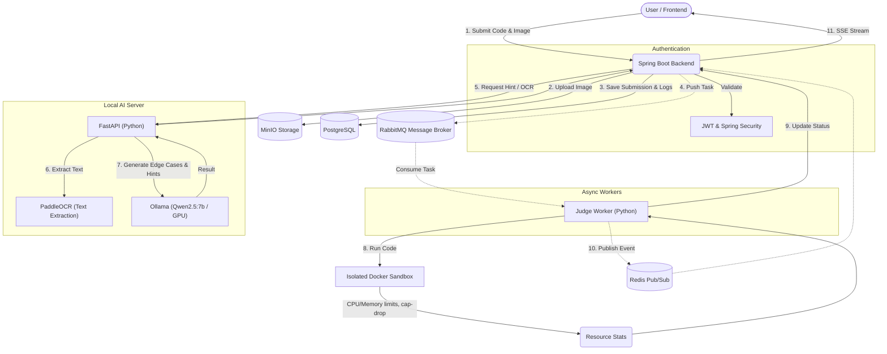

# 🚀 AI 기반 알고리즘 악질 저지(Judge) 및 리뷰 플랫폼

<div align="center">
  <h3>"단순한 문법 오류를 넘어, 치명적인 엣지 케이스(Edge Case)를 찾아내는 AI 채점 플랫폼"</h3>
</div>

---

## 📖 1. 기획 배경 및 문제 정의 (Background & Problem)
알고리즘 문제풀이 경험을 통해 기존 플랫폼들을 통한 학습의 한계를 느껴서 직접 만들게 되었습니다. 
- **기존의 한계**: ChatGPT 등 상용 AI는 코드를 잘 짜주지만, 유저가 제출한 코드의 논리적 반례(Edge Case)'나 '경계값(Boundary)'을 찾아내는 데는 매우 취약합니다.
- **해결책 (Our Solution)**: 
  1. 알고리즘 반례 생성에 특화된 데이터셋으로 **자체 AI 파이프라인(현재 Ollama Qwen 기반, 향후 파인튜닝 예정)**을 구축합니다.
  2. 단순히 AI 프롬프트에 의존하는 것이 아니라, 실제 코드를 **샌드박스 환경에서 격리 실행(Judge)**하여 정확히 검증합니다.
  3. 클라우드 벤더(OpenAI 등 외부 API)에 종속되지 않는 **로컬 100% Cloud-Native / 오픈소스 기반의 마이크로서비스 아키텍처**를 설계하여 운영 비용과 트래픽에 유연하게 대응합니다.

---

## 🏗 2. 시스템 아키텍처 (System Architecture)



---

## ✨ 3. 핵심 기능 및 워크플로우 (Core Workflow)
1. **문제 스캔 (OCR)**: FastAPI 서버의 `PaddleOCR` 모듈이 문제 캡처본에서 제약 조건과 한글 텍스트를 정확히 추출.
2. **반례 생성 (AI Inference)**: 로컬 GPU를 활용하는 `Ollama` 모델(Qwen)이 문제 조건을 분석하여 까다로운 엣지 케이스 데이터 생성.
3. **병렬 샌드박스 채점 (Judge Engine)**: 커스텀 Python 워커(`worker.py`)가 Docker API를 제어하여, 일회용 격리 컨테이너를 띄워 유저의 코드를 안전하게 채점. 정답 기댓값과 실제 출력을 완벽히 비교(`==`)하여 성공 여부 판정.
4. **리뷰 분석 (AI Review)**: 채점 실패 시(`FAIL`), 유저가 프론트엔드의 **[💡 AI 힌트 받기]** 버튼을 눌러 시간/공간 복잡도를 분석한 정밀한 힌트를 제공받음.
5. **실시간 피드백 (SSE)**: 각 테스트 케이스별 채점 진행 상황을 프론트엔드로 `Server-Sent Events (SSE)`를 통해 실시간 브로드캐스팅.
6. **(예정) 사용자 대시보드**: JWT 기반 로그인 후, 사용자별 제출 기록, 정답률, AI 힌트 열람 로그 등을 시각화하여 제공.

---

## 🛠 4. 기술 스택 및 엔지니어링 챌린지

### 4.1. 기술 스택 (Tech Stack)
- **Frontend**: React, Next.js, TailwindCSS, Monaco Editor (웹 IDE)
- **Backend API**: Java 17, Spring Boot, Spring Data JPA, Spring WebFlux (SSE 통신), **Spring Security & JWT (인증/인가)**
- **Message Broker / Cache**: RabbitMQ (채점 비동기 큐), Redis (SSE 상태 브로드캐스팅)
- **Database / Storage**: PostgreSQL, MinIO (S3 호환)
- **Sandbox / DevOps**: Python Docker SDK, Docker Compose, **Nginx & Cloudflare (호스팅/프록시 예정)**
- **AI Server**: FastAPI, PaddleOCR, Ollama (Qwen 2.5)

### 4.2. 핵심 엔지니어링 주안점 (Engineering Highlights)
- **🛡️ 완벽한 샌드박스 보안 (Security Hardening)**: 
  악의적인 코드(Fork Bomb 등)로부터 호스트를 보호하기 위해 채점 컨테이너 실행 시 `--network none`, `--memory 256m`, `--pids-limit 64`, `--cap-drop=ALL` 옵션을 엄격하게 적용.
- **⚡ 이기종 언어(Polyglot) 간 비동기 분산 처리**: 
  Spring Boot(Java)의 안정적인 웹 응답 처리와 Python(Worker)의 샌드박스 연산을 `RabbitMQ`를 통한 메시징으로 완벽히 분리하여 트래픽 병목을 방지.
- **⚙️ 의존성 없는 AI 마이크로서비스**: 
  Windows 11 로컬 환경의 최신 Python 버전(3.13) 충돌을 피해, `FastAPI` + `PaddleOCR` 서버를 리눅스 도커 컨테이너 환경으로 완벽히 격리.

---

## 🗄️ 5. 데이터베이스 구조 (ERD 요약)
- **Users**: 유저 인증 정보 (이메일, 비밀번호 암호화), 권한(Role)
- **RefreshTokens**: JWT 보안 강화를 위한 리프레시 토큰 저장소
- **Problems**: 알고리즘 문제 메타데이터
- **Submissions**: 제출 코드, 언어, 종합 결과(`status`, `result_output`), **유저 외래키 연동**
- **UserLogs**: 사용자별 활동 로그 (로그인 시간, 문제 풀이 시도 횟수, AI 힌트 사용 기록)

---

## 🗺️ 6. 향후 로드맵 및 프로덕션 호스팅 (Future Roadmap & Hosting)
로컬 개발 완료 이후 실제 서비스를 위한 배포(Hosting)를 고려하여 다음과 같이 시스템을 확장할 예정입니다:

1. **보안 및 인증 (JWT & Spring Security)**
   - 상태 비저장(Stateless) 아키텍처를 유지하며 회원가입/로그인 구현.
   - JWT Access Token 및 Redis 기반 Refresh Token 도입.
2. **사용자 경험 (마이페이지 & 로그 대시보드)**
   - 회원별 '내가 푼 문제', '틀린 문제', 'AI 힌트 기록'을 확인할 수 있는 대시보드 개발.
3. **프로덕션 호스팅 배포 전략 (Production Hosting)**
   - **Web/DB**: AWS EC2 또는 NCP 인스턴스에 백엔드와 프론트엔드를 배포. Nginx 리버스 프록시 적용.
   - **AI Server**: 로컬 물리 GPU(RTX 4070 Super) 서버를 클라우드와 터널링(Cloudflare Tunnels 또는 Ngrok)하여 비용 0원의 자체 AI 호스팅 인프라 구축. 
   - DNS 및 SSL은 Cloudflare를 통해 캐싱 및 보안(DDoS 방어) 통합 적용.

---

## 📂 7. 프로젝트 폴더 구조
```text
.
├── docker-compose.yml        # 인프라(DB, 큐, Redis) 및 AI 서버(FastAPI) 오케스트레이션
├── frontend/                 # Next.js 프론트엔드 (Port 3000)
├── backend_api/              # Spring Boot 메인 웹 서버 (Port 8080)
├── judge_worker/             # 커스텀 샌드박스 채점 엔진 (RabbitMQ Worker)
└── ai_server/                # PaddleOCR 및 Ollama 연동 FastAPI 서버 (Port 8000)
```

---

## 🚀 8. 실행 방법 (Getting Started)

본 프로젝트는 Windows 환경(GPU 권장)을 기준으로 작성되었습니다.

### 사전 요구 사항
- **Docker Desktop** (WSL2 기반 실행 권장)
- **Node.js** (v18 이상)
- **Java 17** 및 **Gradle**
- **Python 3.10 이상**
- [Ollama for Windows](https://ollama.com/) 설치

### 실행 단계

**1. 인프라 및 AI 서버 구동 (Docker Compose)**
```bash
# DB(PostgreSQL), Redis, RabbitMQ, MinIO, AI Server 띄우기
docker-compose up -d --build
```

**2. 로컬 AI 모델 로드 (Ollama)**
```bash
# 터미널을 열고 Ollama Qwen 모델 다운로드 및 실행
ollama run qwen2.5:7b
```

**3. 백엔드(Spring Boot) 구동**
```bash
cd backend_api
./gradlew bootRun
```

**4. 채점 워커(Python) 구동**
```bash
cd judge_worker
python worker.py
```

**5. 프론트엔드(Next.js) 구동**
```bash
cd frontend
npm run dev
# 브라우저에서 http://localhost:3000 접속!
```
